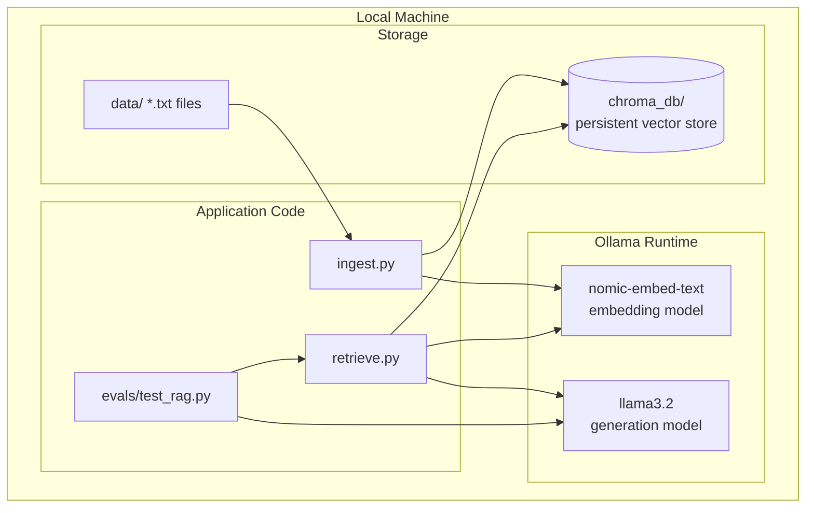
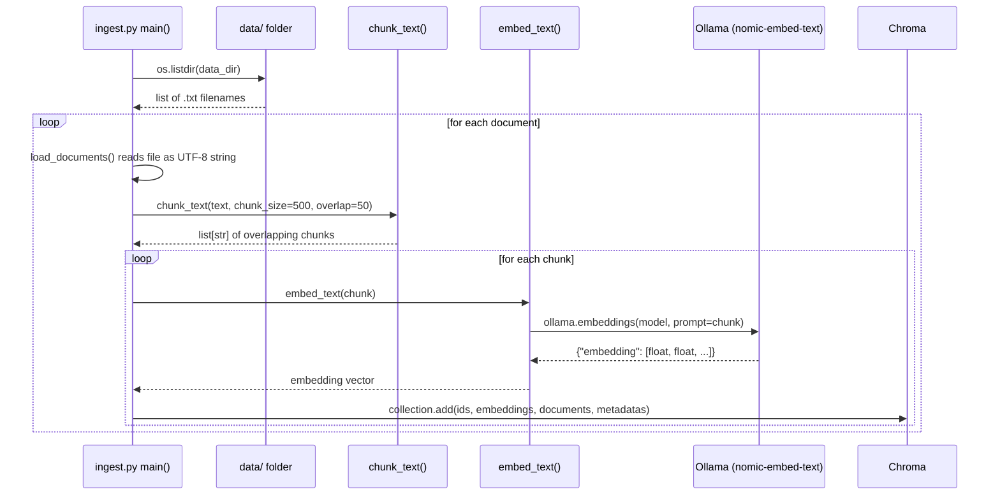
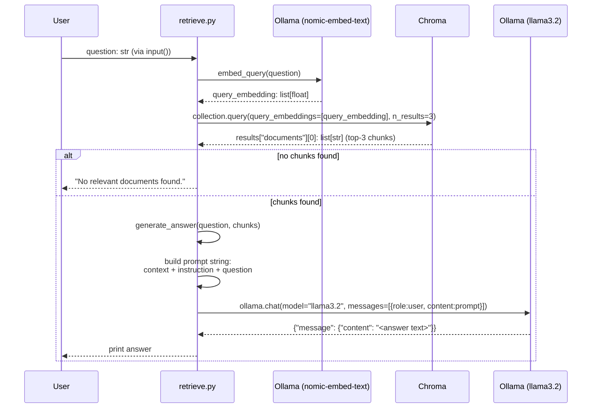
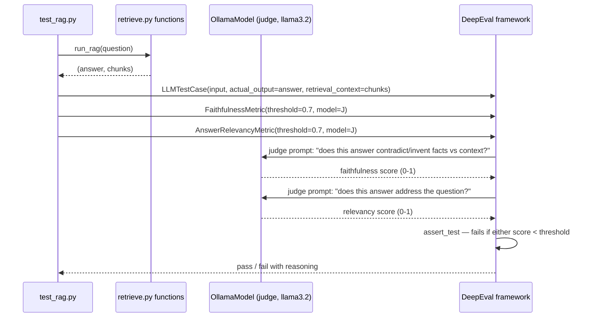

# Architecture

## 1. System overview

A fully local Retrieval-Augmented Generation (RAG) system with an
automated evaluation layer. Three independent stages — ingestion,
retrieval+generation, and evaluation — share a common local vector
store and a common local LLM runtime (Ollama). No network calls leave
the machine at any point.



## 2. Component responsibilities

| Component | File | Responsibility | Depends on |
|---|---|---|---|
| Ingestion | `src/ragbot/ingest.py` | Turn raw `.txt` files into searchable vectors | Chroma, Ollama (embedding) |
| Retrieval + Generation | `src/ragbot/retrieve.py` | Answer a question grounded in stored documents | Chroma, Ollama (embedding + chat) |
| Agent (planned) | `src/ragbot/agent.py` | Tool-calling loop on top of retrieval | retrieve.py, Ollama |
| Evaluation | `evals/test_rag.py` | Automatically verify correctness and safety | retrieve.py, DeepEval, Ollama (as judge) |

## 3. Ingestion — detailed flow



**Exact data shapes at each step:**
- `load_documents()` returns `list[dict]`, each `{"id": "<filename>", "text": "<full file contents as str>"}`
- `chunk_text(text, chunk_size=500, overlap=50)` returns `list[str]` — implemented as a sliding window: `start = 0`, slice `text[start:start+500]`, then `start += 450` (500 − 50 overlap), repeat until `start >= len(text)`
- `embed_text(chunk)` returns `list[float]` — a single embedding vector, dimensionality determined by `nomic-embed-text` (768 dimensions)
- Each Chroma `collection.add()` call stores exactly one chunk with:
  - `ids=["<filename>_<chunk_index>"]` — globally unique per chunk
  - `embeddings=[<768-float vector>]`
  - `documents=["<chunk text>"]` — the raw text, kept for later retrieval
  - `metadatas=[{"source": "<filename>"}]` — enables tracing an answer back to its source file

**Persistence:** `chromadb.PersistentClient(path="chroma_db")` writes to disk immediately on `.add()` — no explicit save/flush step needed, and the data survives between script runs.

## 4. Retrieval + Generation — detailed flow



**The exact prompt template sent to the LLM:**
```
Answer the question using only the context below.
If the context doesn't contain the answer, say "I don't know based on the available documents."

Context:
{context}

Question: {question}
Answer:
```
where `{context}` is the retrieved chunks joined with `"\n\n"`, and `{question}` is the raw user input. This template is the single point of control for the hallucination guardrail — any change to grounding behavior happens here.

**Why `n_results=3` (top_k):** a tunable trade-off. Too few chunks risks missing the answer if it's split across chunks; too many dilutes the prompt with irrelevant text and increases the chance the model latches onto the wrong passage. 3 is a reasonable default for a small document set.

## 5. Evaluation — detailed flow



**Two distinct test cases, two distinct purposes:**
1. `test_sourdough_question` — positive case. Confirms the pipeline retrieves the *correct* chunk and produces a faithful, relevant answer when the documents genuinely contain the answer.
2. `test_unrelated_question_says_dont_know` — negative/safety case. Confirms the pipeline does *not* hallucinate when the documents don't contain the answer — this is a direct, automated test of the prompt guardrail described in section 4.

**Why the judge model matters:** `FaithfulnessMetric` and `AnswerRelevancyMetric` don't use simple string matching — they use an LLM to *reason* about whether the answer is supported by the context. `judge_model = OllamaModel(model="llama3.2", base_url="http://localhost:11434")` points that reasoning step at the same local model already running, so evaluation costs nothing and needs no external API key.

## 6. Configuration surface

| Constant | Location | Current value | What changing it affects |
|---|---|---|---|
| `CHUNK_SIZE` | `ingest.py` | 500 chars | Larger = fewer, broader chunks; smaller = more precise but more fragmented retrieval |
| `OVERLAP` | `ingest.py` | 50 chars | Reduces risk of splitting an idea across chunk boundaries |
| `EMBED_MODEL` | both files | `nomic-embed-text` | Must be identical in ingestion and retrieval, or vectors aren't comparable |
| `CHAT_MODEL` | `retrieve.py` | `llama3.2` | The generation model; swappable for any Ollama-compatible model |
| `top_k` | `retrieve_chunks()` | 3 | Number of chunks retrieved per query |
| `threshold` | `evals/test_rag.py` | 0.7 | Minimum acceptable faithfulness/relevancy score before a test fails |

## 7. Known limitations (explicit, not hidden)

- **Small corpus behavior:** with very few documents, Chroma still returns its "closest available" match even when nothing is truly relevant — retrieval quality depends on having a reasonably sized, topically diverse document set.
- **No prompt-injection defense yet:** a malicious instruction embedded inside a source document could currently influence the LLM's behavior. Planned for Phase 3.5.
- **No chunk deduplication:** re-running `ingest.py` on the same files adds duplicate entries rather than updating existing ones — acceptable for a learning project, not yet production-safe.
- **Single-turn only:** `retrieve.py` has no conversation memory; each question is independent.

## 8. Planned extensions (not yet built)

- **Agent loop (`agent.py`):** wrap `retrieve_chunks`/`generate_answer` as a callable tool inside a decide → act → observe loop, adding the ability to call external tools beyond retrieval.
- **MCP server:** expose one external API (still to be chosen) as a Model Context Protocol tool the agent can call.
- **Prompt-injection test suite:** adversarial documents in `evals/` designed to try to hijack the system prompt, with pass/fail assertions.